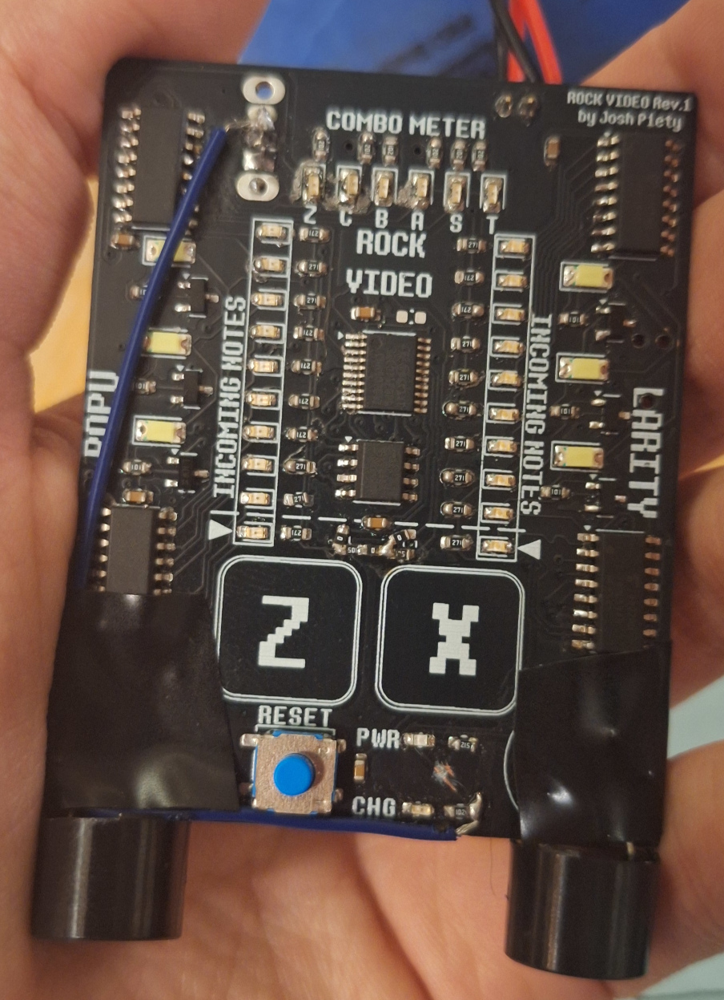

# GuitarGame
DELTARUNE's guitar rhythm game in electronic form using an STM32 microcontroller.
KiCAD EDA files are in the top level directory. `firmware/` contains the code.

## Design
- An STM32C071FBP6 microcontroller is at the core.
- Power is supplied from a 4.2V LiPo, managed using a BQ21040, or a USB-C port, via an LDO.
- Four 74HC594 shift registers are used to control the LEDs.
- Two piezo speakers are driven by the STM32 to produce audio.
- Two capacitive touch pads are driven through 1 megaohm resistors.
